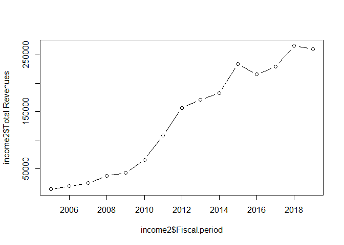
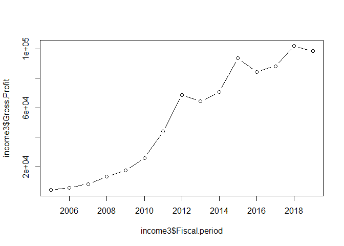

Apple Report
================

## First

[**7/10/20:appleincome.R**](../R/appleincome.R): I downloaded an excel
file on Apple’s income statement from 2005 - present time from
<https://advisortools.zacks.com/Research/Stocks/AAPL/Financials>, and
edited it on excel by flipping columns and rows. I then uploaded it as a
.csv file into R, where I cleaned up the chart by removing the commas
from the numbers in order to make the data numeric and removed any N/A
lines. I then used the `plot()` and `ggplot()` functions to produced
graphs on Apple’s total revenue and gross
profit.

``` r
source("../R/applesource.R")
```

<!-- --><!-- -->

``` r
#The first plot graphs Apple's total revenue from 2005 to present, and the second plot graphs Apple's gross profit from 2005 to present. In both graphs, very similar trends pan out: there is a near exponential growth and the dips and rise of the two plots mirror each other.
```
