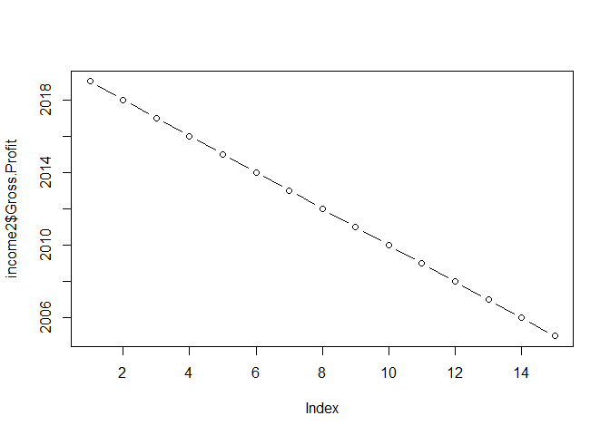
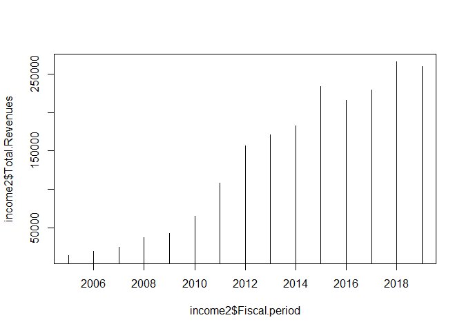

Apple Report
================

## First

**7/10/20:appleincome.R**: I downloaded an excel file on Apple’s income
statement from 2005 - present time from
<https://advisortools.zacks.com/Research/Stocks/AAPL/Financials>, and
edited it on excel by flipping columns and rows. I then uploaded it as a
.csv file into R, where I cleaned up the chart by removing the commas
from the numbers in order to make the data numeric and removed any N/A
lines. I then used the `plot()` and `ggplot()` functions to produced
graphs on Apple’s total revenue and gross
profit.

``` r
source("../R/appleincome.R")
```

    ## Warning: package 'ggplot2' was built under R version 3.6.3

<!-- --><!-- --><!-- --><!-- -->

``` r
plot(x=income2$Fiscal.period, y = income2$Total.Revenues, type = "b")
```

<!-- -->

``` r
plot(x=income2$Fiscal.period, y = income2$Total.Revenues, type = "h")
```

<!-- -->
