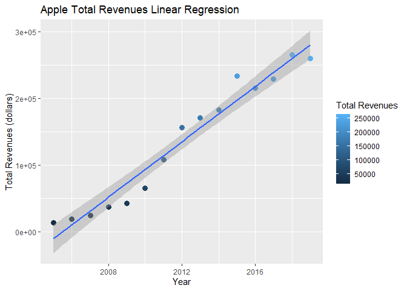
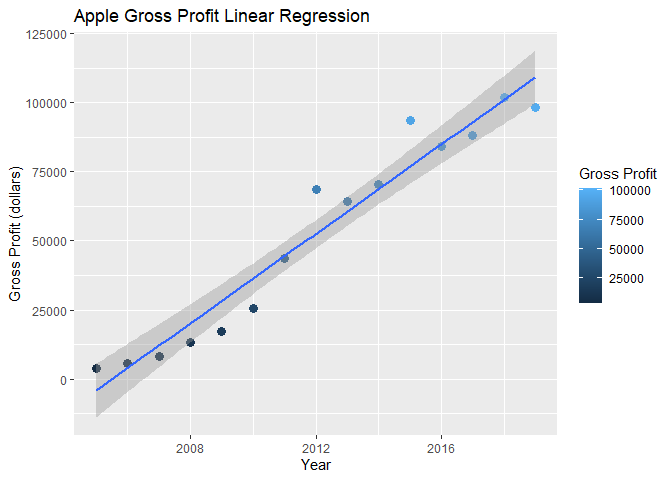

Apple Statistics
================

## First

[**7/30/20:applegraphs.R**](../R/applegraphs.R): I cleaned up the graphs
by making more aesthetically pleasing plots, as well as producing plots
with linear regression lines.

``` r
source("../R/applegraphs.R")
ggplot(data = income2, mapping = aes(x = Fiscal.period, y = Total.Revenues, color = factor(Total.Revenues))) +
  geom_point(size = 3) + 
  labs(title = "Apple Total Revenues Scatter Plot", x = "Year", y = "Total Revenues (dollars)", color = "Total Revenues")
```

<!-- -->

This first plot simply graphs total revenues against fiscal period. From
a closer scope, the data seems to grow exponentially up until 2012,
where it oscillates around a linear line.

``` r
source("../R/applegraphs.R")
ggplot(data = income2, mapping = aes(x = Fiscal.period, y = Total.Revenues, color = Total.Revenues)) +
  scale_shape_identity() +
  geom_point(size = 3) + 
  geom_smooth(method = "lm", aes(fill = Total.Revenues)) +
  labs(title = "Apple Total Revenues Linear Regression", x = "Year", y = "Total Revenues (dollars)", color = "Total Revenues")
```

    ## `geom_smooth()` using formula 'y ~ x'

<!-- -->

The second plot graphs the linear regression line on the data. From a
larger scope, it becomes apparent that the data is relatively linear and
that the regression line represents the data well. This indicates that
the correlation coefficient is most likely positive and close to 1. The
coefficient of determination also most likely is close to one, as a high
percentage of data can be accounted for by the line of regression:
looking at the shaded region, only a few points do not fall within the
area (this is the 95% confidence interval).

``` r
source("../R/applegraphs.R")
ggplot(data = income3, mapping = aes(x = Fiscal.period, y = Gross.Profit, color = factor(Gross.Profit))) +
  geom_point(size = 3) +
  labs(title = "Apple Gross Profit Scatter Plot", x = "Year", y = "Gross Profit (dollars)", color = "Gross Profit")
```

<!-- -->

``` r
ggplot(data = income3, mapping = aes(x = Fiscal.period, y = Gross.Profit, color = Gross.Profit)) +
  scale_shape_identity() +
  geom_point(size = 3) + 
  geom_smooth(method = "lm", aes(fill = Gross.Profit)) +
  labs(title = "Apple Gross Profit Linear Regression", x = "Year", y = "Gross Profit (dollars)", color = "Gross Profit")
```

    ## `geom_smooth()` using formula 'y ~ x'

<!-- -->

I then did the same with gross profit. The trends are very similar, so
the same commentary that I made for total revenues similarly applies to
gross profit. This isn’t surprising, as gross profit and total revenues
undoubtedly rise and fall together as they are very similar in theory.

## Second

[**7/31/20:applegraphs2.R**](../R/applegraphs2.R): I transformed the
scatter plots of total revenues and gross profit with log transform
(log10). Log transformations are useful in dealing with skewed data,
making them appeared less skewed for further observation. The log plot
does look relatively linear, though there is a noticeable change in year
2012.

``` r
source("../R/applegraphs2.R")
p + scale_x_log10() + scale_y_log10()
```

<!-- -->

``` r
q + scale_x_log10() + scale_y_log10()
```

<!-- -->

I then converted the scatter plots into bar plots, making it
aesthetically pleasing with the colors and outline.

``` r
source("../R/applegraphs2.R")
ggplot(income2, aes(x = Fiscal.period, y = Total.Revenues)) +
  geom_bar(stat = "identity", color = "blue", fill = rgb(0.2,0.6,0.8,0.7)) +
  labs(title = "Apple Total Revenues Bar Plot", x = "Year", y = "Total Revenues (dollars)")
```

<!-- -->

``` r
ggplot(income3, aes(x = Fiscal.period, y = Gross.Profit)) +
  geom_bar(stat = "identity", color = "purple", fill = rgb(.6, .6, 1, .7)) +
  labs(title = "Apple Gross Profit Bar Plot", x = "Year", y = "Gross Profit (dollars)")
```

<!-- -->

This first bar plot graphs total revenues against fiscal period, and the
second graphs gross profit. The trend is, obviously, the same as with
the scatter plots.
