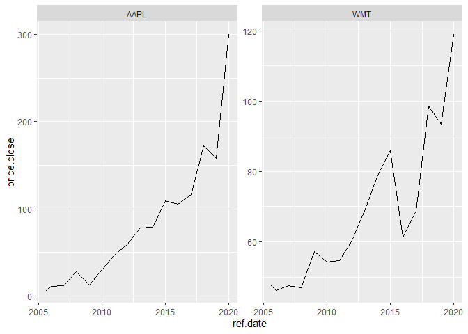

Data Collection
================

## First

[**8/7/20:datacollection1.R**](../R/datacollection1.R): I used the
BatchGetSymbols package to collect data from Apple, Facebook, and
Walmart from the past 15 years. I did this by setting a starting date,
end date, and tickers that told the package to collect the data from the
yahoo database.

``` r
source("../R/datacollection1.R")
```

    ## Loading required package: rvest

    ## Loading required package: xml2

    ## Loading required package: dplyr

    ## 
    ## Attaching package: 'dplyr'

    ## The following objects are masked from 'package:stats':
    ## 
    ##     filter, lag

    ## The following objects are masked from 'package:base':
    ## 
    ##     intersect, setdiff, setequal, union

    ## 

    ## 
    ## Running BatchGetSymbols for:
    ##    tickers =AAPL, FB, WMT
    ##    Downloading data for benchmark ticker
    ## ^GSPC | yahoo (1|1) | Not Cached | Saving cache
    ## AAPL | yahoo (1|3) | Not Cached | Saving cache - Got 100% of valid prices | Got it!
    ## FB | yahoo (2|3) | Not Cached | Saving cache - Got 55% of valid prices | OUT: not enough data (thresh.bad.data = 75%)
    ## WMT | yahoo (3|3) | Not Cached | Saving cache - Got 100% of valid prices | OK!

    ## # A tibble: 3 x 6
    ##   ticker src   download.status total.obs perc.benchmark.dates threshold.decision
    ##   <chr>  <chr> <chr>               <int>                <dbl> <chr>             
    ## 1 AAPL   yahoo OK                   3773                1     KEEP              
    ## 2 FB     yahoo OK                   2068                0.548 OUT               
    ## 3 WMT    yahoo OK                   3773                1     KEEP

<!-- -->

Both companies experienced near exponential growth.
