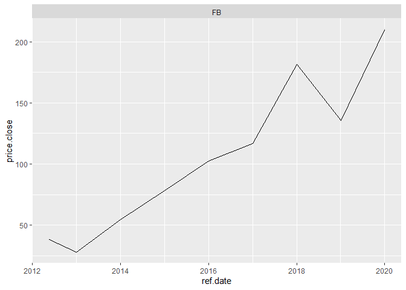

Data Collection
================

## First

[**8/7/20:datacollection1.R**](../R/datacollection1.R): I used the
BatchGetSymbols package to collect data from Apple and Walmart from the
past 15 years and then Facebook for the past 10. I did this by setting a
starting date, end date, and tickers that told the package to collect
the data from the yahoo database.

``` r
source("../R/datacollection1.R")
```

    ## Loading required package: rvest

    ## Loading required package: xml2

    ## Loading required package: dplyr

    ## 
    ## Attaching package: 'dplyr'

    ## The following objects are masked from 'package:stats':
    ## 
    ##     filter, lag

    ## The following objects are masked from 'package:base':
    ## 
    ##     intersect, setdiff, setequal, union

    ## 

    ## 
    ## Running BatchGetSymbols for:
    ##    tickers =AAPL, WMT
    ##    Downloading data for benchmark ticker
    ## ^GSPC | yahoo (1|1) | Not Cached | Saving cache
    ## AAPL | yahoo (1|2) | Not Cached | Saving cache - Got 100% of valid prices | Well done!
    ## WMT | yahoo (2|2) | Not Cached | Saving cache - Got 100% of valid prices | You got it!

    ## # A tibble: 2 x 6
    ##   ticker src   download.status total.obs perc.benchmark.dates threshold.decision
    ##   <chr>  <chr> <chr>               <int>                <dbl> <chr>             
    ## 1 AAPL   yahoo OK                   3773                    1 KEEP              
    ## 2 WMT    yahoo OK                   3773                    1 KEEP

    ## 
    ## Running BatchGetSymbols for:
    ##    tickers =FB
    ##    Downloading data for benchmark ticker
    ## ^GSPC | yahoo (1|1) | Found cache file
    ## FB | yahoo (1|1) | Not Cached | Saving cache - Got 82% of valid prices | OK!

<!-- -->

    ## # A tibble: 1 x 6
    ##   ticker src   download.status total.obs perc.benchmark.dates threshold.decision
    ##   <chr>  <chr> <chr>               <int>                <dbl> <chr>             
    ## 1 FB     yahoo OK                   2071                0.823 KEEP

<!-- -->

Apple and Walmart experienced exponential growth while Facebook’s seems
more linear, though still irregular. In the past year, Facebook
experienced very steep, linear growth.
